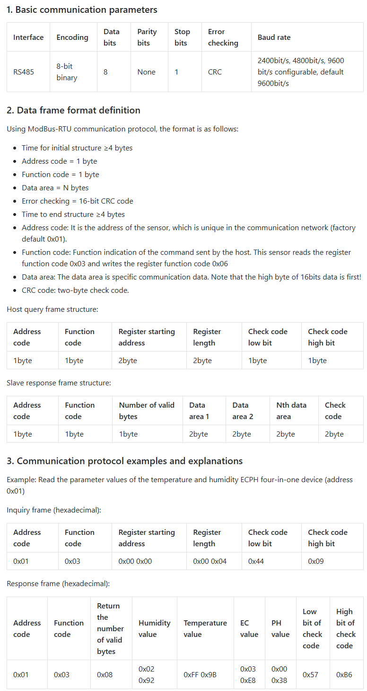
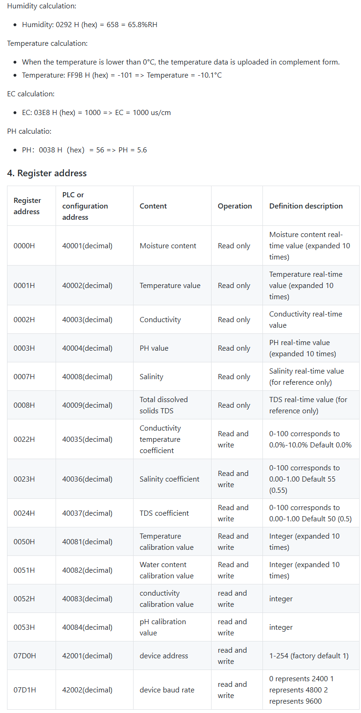

# RS485-Halisense-Soil-Sensor

# Useful Links
- [Halisense Soil Sensor Library](https://registry.platformio.org/libraries/dvelaren/Halisense_SoilSensor)
- [RS485 Soil Sensor(Temperature&Humidity&EC&PH) Arduino WiKi- DFRobot](https://wiki.dfrobot.com/RS485_Soil_Sensor_Temperature_Humidity_EC_PH_SKU_SEN0604)

# Frame

# Data

# Usefull info 
- default baud rate 4800!!!

